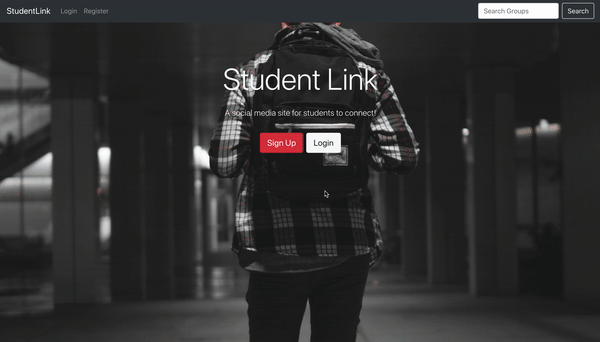

# StudentLink

## What is the project?

StudentLink is an open source social media site built in the MERN stack (MongoDB, Express.js, React.js, and Node.js).

## Installation

To install, clone the directory using the command:

`git clone https://github.com/Andrewgraemebrooks/StudentLink.git`

After cloning the files run the following npm command:

`npm install && npm run front-end-install`

The current version requires the use:

- The Redux DevTools Extension:
  [Google Chrome](https://chrome.google.com/webstore/detail/redux-devtools/lmhkpmbekcpmknklioeibfkpmmfibljd),
  [Firefox](https://addons.mozilla.org/en-US/firefox/addon/reduxdevtools/)
- A local installation of MongoDB:
  [MongoDB Community Edition](https://docs.mongodb.com/manual/installation/)

## Usage

To start both the react and express server, run the following command:

`npm run dev`

Using the user interface, the user can register, login, and create a profile.
With the installation of a an API interrogator such as [Postman](https://www.postman.com/), a developer can create users, profiles, groups, posts, likes, comments, and chat with other users. Future development of this project aims to bring all of the back-end features to the front-end.

## Thanks

Thank you to all my teachers, friends, and family who helped me during the development of this project.

## License

StudentLink is [MIT-Licensed](LICENSE)
